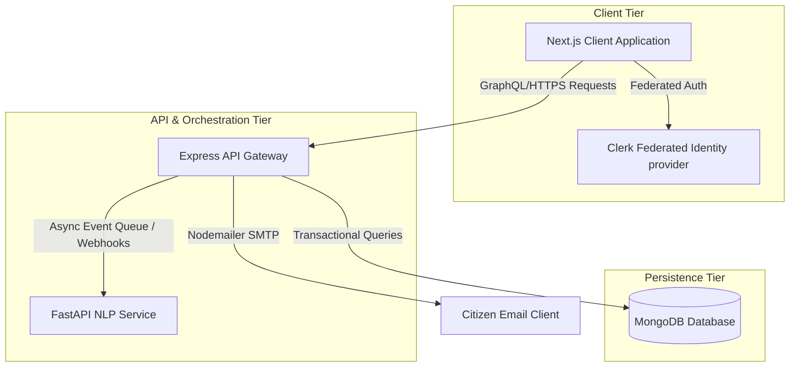

# CivicConnect: Enterprise Civic Issue Resolution & Management Platform

CivicConnect is an enterprise-grade, microservice-based application suite designed to streamline municipal complaint reporting, geospatial issue analysis, and citizen-administration communication. By integrating predictive Natural Language Processing (NLP) and vector-similarity duplicate detection, CivicConnect enables local administrations to automatically intake, prioritize, and resolve citizen incidents.

---

## 🏗️ System Architecture

The platform is structured as a decoupled multi-tier architecture consisting of a Next.js single-page application client, an Express API gateway, a FastAPI analytical service, and a MongoDB persistence layer.



---

## 💡 Core Functional Modules

### 1. Citizen Portal & Intake
* **Intelligent Intake Form**: Fully responsive dashboard supporting dynamic field mapping, categorization, and multimedia (image) attachment uploading.
* **Automatic Geolocation Resolution**: Real-time GPS coordinate triangulation with fallback query-string geocoding for manual addresses.
* **Incident Lifecycle Monitor**: Public complaints registry featuring direct live-reload capability and visual status logs (Pending, Under Process, Resolved).
* **Intelligent Support Chatbot**: Conversational AI assistant trained to answer civic-related inquiries and guide users through reporting workflows.

### 2. Administrative Console
* **Intelligent Backlog Management**: Unified ticket table enabling status updates, direct email dispatch, and severity overrides.
* **Dynamic Priority Orchestration**: Automatic calculation of issue urgency (High, Medium, Low) using location density thresholds. These thresholds scale sub-linearly ($\text{threshold} = \max(\text{Base}, \text{ceil}(\text{Base} \times \sqrt{N/20}))$) as overall platform density grows.
* **Live Geospatial Console**: Heatmaps and priority-colored map pins (Red/Yellow/Blue) with auto-centering bounds zoom to identify infrastructure hot spots.
* **Executive Analytics Panel**: Interactive KPI metrics (Backlog Counts, Unresolved Severity, Resolution Rates) and multi-chart reporting (Breakdowns by Category and Status).

### 3. Predictive AI Microservices
* **Sentiment Classification**: Real-time VADER Sentiment Analysis to classify complaint descriptions into Positive, Negative, or Neutral tones.
* **Intelligent Deduplication**: TF-IDF (Term Frequency-Inverse Document Frequency) vectorization combined with Cosine Similarity checking to identify duplicate filings and prevent database spam.

---

## 🛠️ Technology Stack

| Layer | Technology | Purpose |
| :--- | :--- | :--- |
| **Frontend** | React, Next.js 15+, Tailwind CSS, Clerk, Lucide React, Recharts | UI Shell, Session State, Visualization |
| **Backend** | Node.js, Express, Nodemailer, Axios | Core API Gateway, Mailer, Middleware |
| **AI Engine** | Python 3.10+, FastAPI, Scikit-Learn, VADER, SciPy | Natural Language Processing, Vector Calculations |
| **Database** | MongoDB Atlas, Mongoose ODM | Document Store, Dynamic Schemas |

---

## ⚙️ Configuration & Environment Setup

### Environment Variables Matrix

To run the platform securely in local or production modes, configure the following variables:

#### Frontend (`/civicconnect-frontend/.env.local`)
* `NEXT_PUBLIC_CLERK_PUBLISHABLE_KEY`: Clerk client credentials.
* `CLERK_SECRET_KEY`: Clerk server communication key.
* `BACKEND_URL`: Hosted Express API gateway endpoint (e.g. `http://localhost:5001` or `https://backend.onrender.com`).
* `ADMIN_API_KEY`: Authentication secret shared with the backend.

#### Backend (`/civicconnect-backend/.env`)
* `MONGODB_URI`: MongoDB connection URI (Atlas string or local MongoDB instance).
* `AI_URL`: Endpoint of the hosted Python AI Service (e.g. `http://localhost:8000` or `https://ai.onrender.com`).
* `EMAIL_USER`: Mailbox address used to route automated notification emails.
* `EMAIL_PASS`: Gmail App Password (16 characters) associated with the dispatcher mail.
* `ADMIN_API_KEY`: Key used to authenticate incoming admin request payloads from Next.js.
* `PORT`: Server listening port (defaulted to `5001` to bypass AirPlay port conflicts on macOS).

---

## 🚀 Execution Instructions

### Prerequisites
* **Node.js** (v18.0.0 or higher)
* **Python** (v3.9.0 or higher)
* **MongoDB Community Server** (running locally on port 27017 or Atlas cloud instance)

### 1. Execute the AI Microservice
```bash
# In the project root directory:
pip install -r requirements.txt
uvicorn main:app --host 127.0.0.1 --port 8000
```

### 2. Execute the Express API Gateway
```bash
cd civicconnect-backend
npm install
node server.js
```

### 3. Execute the Next.js Client
```bash
cd civicconnect-frontend
npm install
npm run dev
```

---

## 📁 Repository Directory Structure

```
CivicConnect/
├── civicconnect-frontend/       # Client Application
│   ├── app/                     # Page Layouts, Context Providers & API Proxies
│   ├── components/              # Interactive Leaflet Maps, Forms, Sidebars
│   └── package.json
│
├── civicconnect-backend/        # Express API Server
│   ├── models/                  # Mongoose MongoDB Data Schemas
│   ├── db.js                    # Database Connection Handler
│   ├── server.js                # Core API Routing & Mailing Controller
│   └── package.json
│
├── main.py                      # FastAPI AI Services Core
├── requirements.txt             # Python Package List
└── README.md                    # System Documentation
```
